# widgets_samples

### Show some :heart: and star the repo to support us
Samples of important flutter widgets that you are going to need in your journey building your first app

   

#### ScreenShots
|  [Appbar & Gridview](https://github.com/sherifhasan/widgets_samples/blob/master/lib/main.dart)|  [Icon](https://github.com/sherifhasan/widgets_samples/blob/master/lib/widgets/icon.dart)|
|---------|-------|
| [TextView](https://github.com/sherifhasan/widgets_samples/blob/master/lib/widgets/text.dart)| 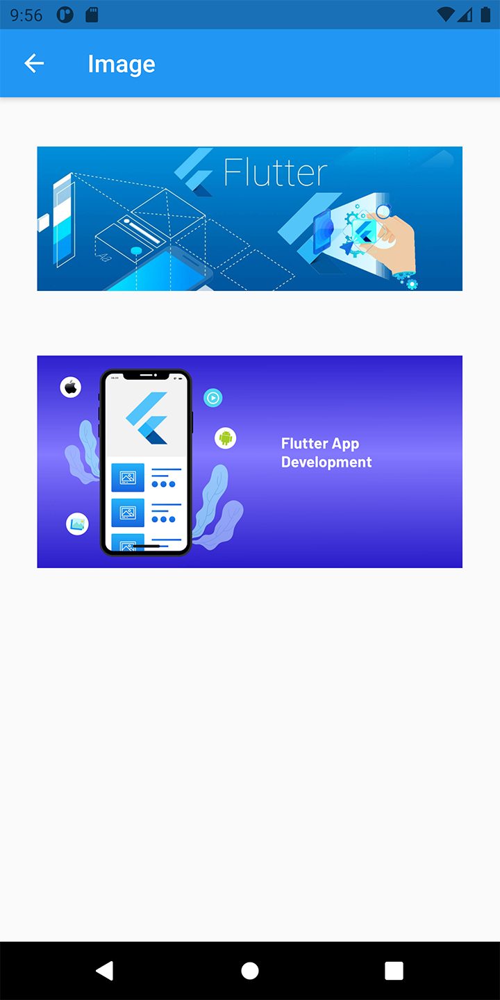 [ImageView](https://github.com/sherifhasan/widgets_samples/blob/master/lib/widgets/image.dart)|

|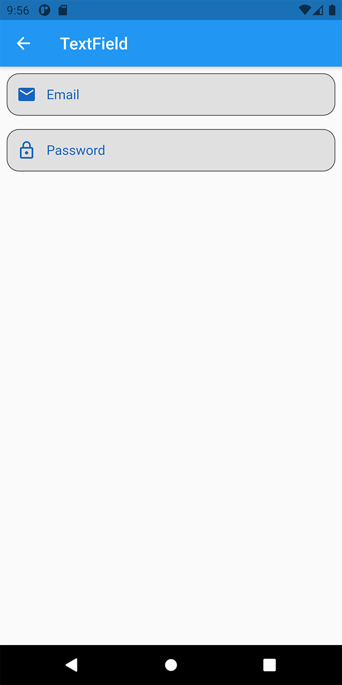 [TextField](https://github.com/sherifhasan/widgets_samples/blob/master/lib/widgets/text_field.dart) | 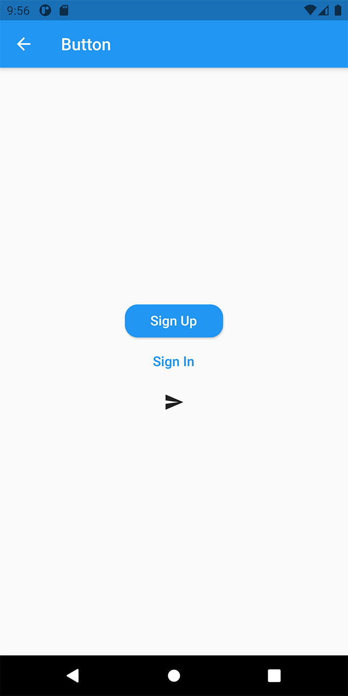 [Button](https://github.com/sherifhasan/widgets_samples/blob/master/lib/widgets/button.dart)|
|-----------------------------------------------|-----------------------------------------------|
|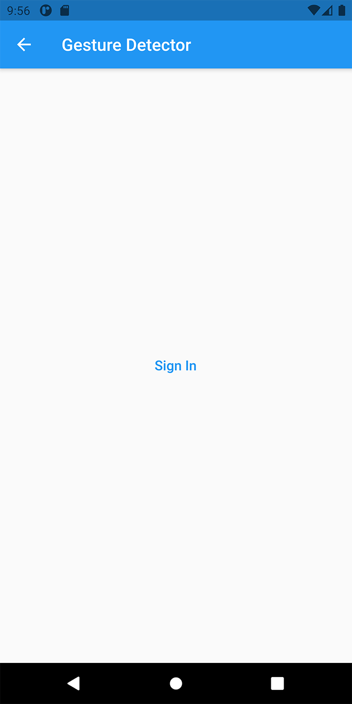 [Gesture Detector](https://github.com/sherifhasan/widgets_samples/blob/master/lib/widgets/gesture_detector.dart) | 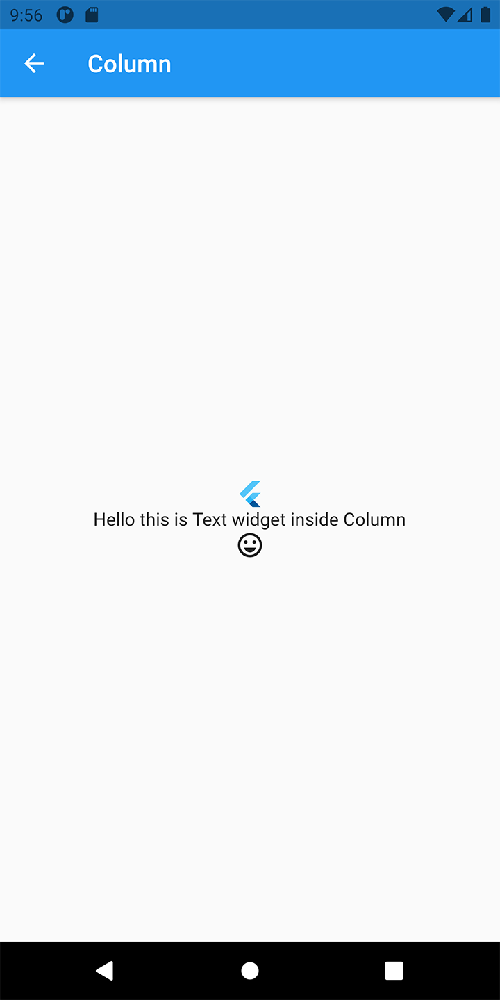 [Column](https://github.com/sherifhasan/widgets_samples/blob/master/lib/widgets/column.dart)|
|-----------------------------------------------|-----------------------------------------------|
|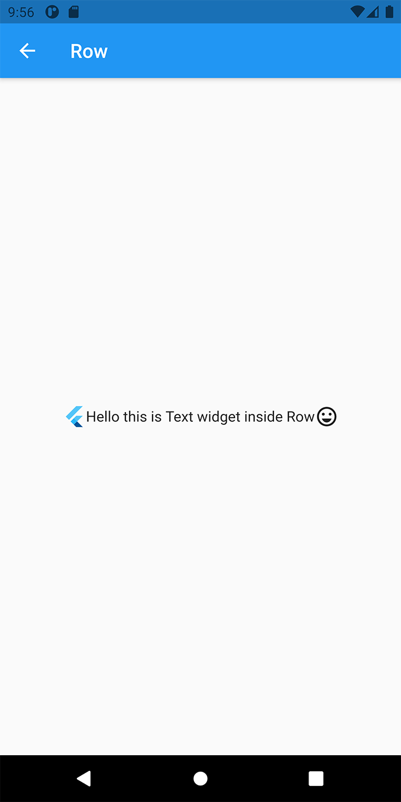 [Row](https://github.com/sherifhasan/widgets_samples/blob/master/lib/widgets/row.dart) | 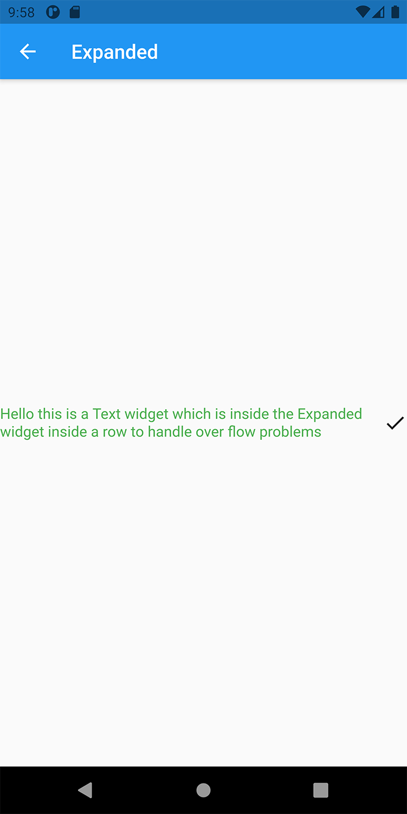 [Expanded](https://github.com/sherifhasan/widgets_samples/blob/master/lib/widgets/expanded.dart)|
|-----------------------------------------------|-----------------------------------------------|
|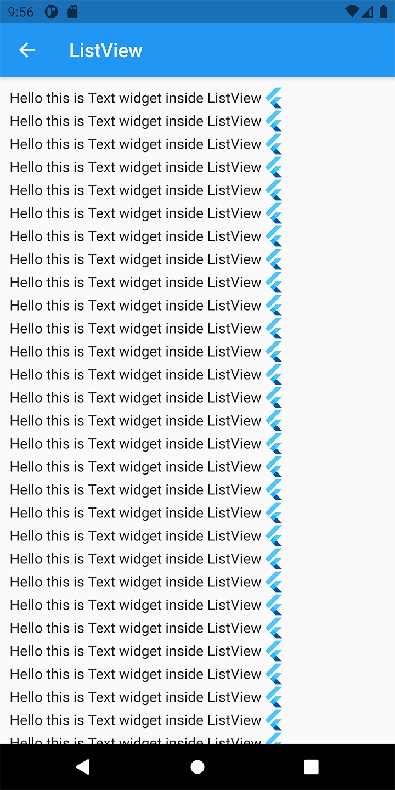 [ListView](https://github.com/sherifhasan/widgets_samples/blob/master/lib/widgets/list_view.dart) | 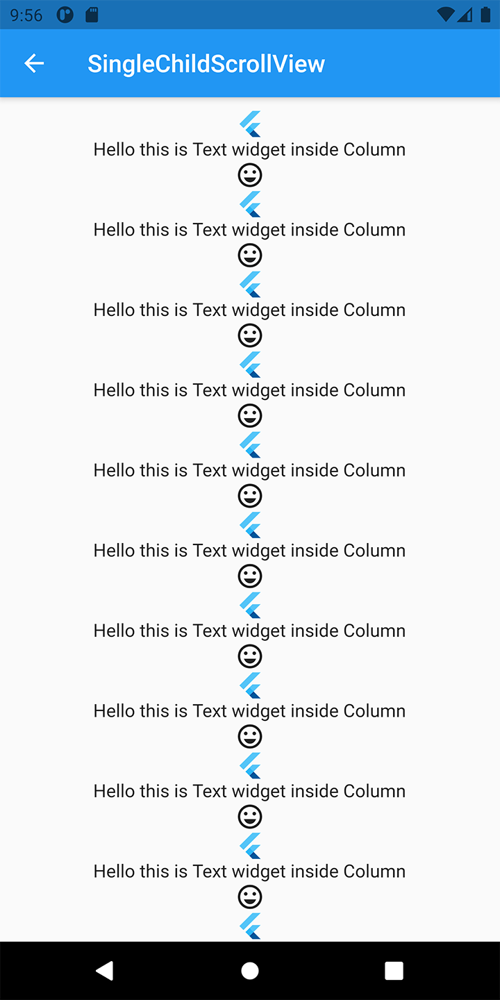 [SingleChildScrollView](https://github.com/sherifhasan/widgets_samples/blob/master/lib/widgets/single_child_scroll_view.dart)|
|-----------------------------------------------|-----------------------------------------------|
|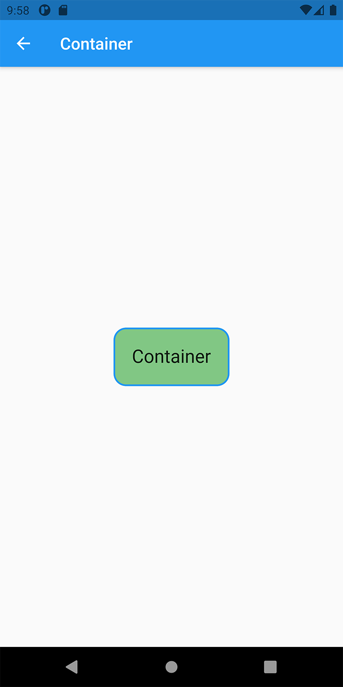 [Container](https://github.com/sherifhasan/widgets_samples/blob/master/lib/widgets/container.dart) | 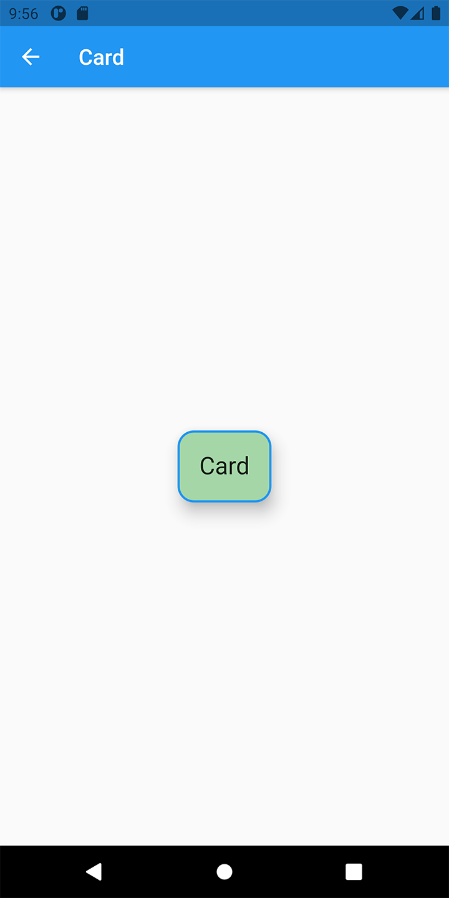 [Card](https://github.com/sherifhasan/widgets_samples/blob/master/lib/widgets/card.dart)|